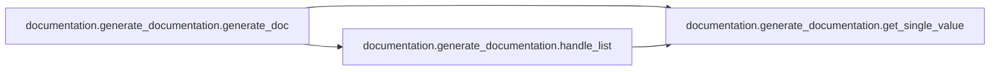
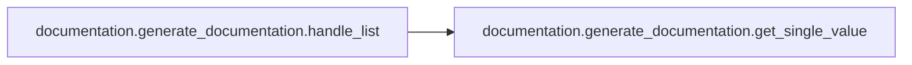
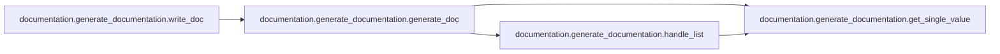
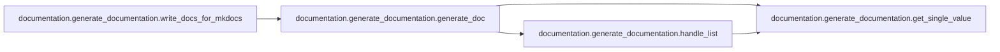

# Documentation Generate Documentation

[_Documentation generated by Documatic_](https://www.documatic.com)

<!---Documatic-section-Codebase Structure-start--->
## Codebase Structure

<!---Documatic-block-system_architecture-start--->
```mermaid
None
```
<!---Documatic-block-system_architecture-end--->

# #
<!---Documatic-section-Codebase Structure-end--->

<!---Documatic-section-documentation.generate_documentation.generate_doc-start--->
## documentation.generate_documentation.generate_doc

<!---Documatic-section-generate_doc-start--->


### Object Calls

* documentation.generate_documentation.get_single_value
* documentation.generate_documentation.handle_list

<!---Documatic-block-documentation.generate_documentation.generate_doc-start--->
<details>
	<summary><code>documentation.generate_documentation.generate_doc</code> code snippet</summary>

```python
def generate_doc(module_type, root_path, logo_path='logos'):
    markdown = []
    current_path = os.path.join(root_path, 'website', module_type)
    files = sorted(os.listdir(current_path))
    githubpath = f'{githublink}/{module_type}'
    for filename in files:
        modulename = filename.split('.json')[0]
        githubref = f'{githubpath}/{modulename}.py'
        markdown.append(f'\n#### [{modulename}]({githubref})\n')
        filename = os.path.join(current_path, filename)
        print(f'Processing {filename}')
        with open(filename, 'rt') as f:
            definition = json.loads(f.read())
        if 'logo' in definition:
            logo = os.path.join(logo_path, definition.pop('logo'))
            markdown.append(f'\n\n')
        if 'description' in definition:
            markdown.append(f"\n{definition.pop('description')}\n")
        for (field, value) in sorted(definition.items()):
            if not value:
                continue
            if isinstance(value, list):
                markdown.append(handle_list(field, value))
                continue
            markdown.append(get_single_value(field, value.replace('\n', '\n>')))
        markdown.append('\n-----\n')
    return markdown
```
</details>
<!---Documatic-block-documentation.generate_documentation.generate_doc-end--->
<!---Documatic-section-generate_doc-end--->

# #
<!---Documatic-section-documentation.generate_documentation.generate_doc-end--->

<!---Documatic-section-documentation.generate_documentation.get_single_value-start--->
## documentation.generate_documentation.get_single_value

<!---Documatic-section-get_single_value-start--->
<!---Documatic-block-documentation.generate_documentation.get_single_value-start--->
<details>
	<summary><code>documentation.generate_documentation.get_single_value</code> code snippet</summary>

```python
def get_single_value(field, value):
    return f'- **{field}**:\n>{value}\n'
```
</details>
<!---Documatic-block-documentation.generate_documentation.get_single_value-end--->
<!---Documatic-section-get_single_value-end--->

# #
<!---Documatic-section-documentation.generate_documentation.get_single_value-end--->

<!---Documatic-section-documentation.generate_documentation.handle_list-start--->
## documentation.generate_documentation.handle_list

<!---Documatic-section-handle_list-start--->


### Object Calls

* documentation.generate_documentation.get_single_value

<!---Documatic-block-documentation.generate_documentation.handle_list-start--->
<details>
	<summary><code>documentation.generate_documentation.handle_list</code> code snippet</summary>

```python
def handle_list(field, values):
    if len(values) == 1:
        return get_single_value(field, values[0])
    values = '\n> - '.join(values)
    return f'- **{field}**:\n> - {values}\n'
```
</details>
<!---Documatic-block-documentation.generate_documentation.handle_list-end--->
<!---Documatic-section-handle_list-end--->

# #
<!---Documatic-section-documentation.generate_documentation.handle_list-end--->

<!---Documatic-section-documentation.generate_documentation.write_doc-start--->
## documentation.generate_documentation.write_doc

<!---Documatic-section-write_doc-start--->


### Object Calls

* documentation.generate_documentation.generate_doc

<!---Documatic-block-documentation.generate_documentation.write_doc-start--->
<details>
	<summary><code>documentation.generate_documentation.write_doc</code> code snippet</summary>

```python
def write_doc(root_path):
    markdown = ['# MISP modules documentation\n']
    for (_path, title) in zip(module_types, titles):
        markdown.append(f'\n## {title}\n')
        markdown.extend(generate_doc(_path, root_path))
    with open('README.md', 'w') as w:
        w.write(''.join(markdown))
```
</details>
<!---Documatic-block-documentation.generate_documentation.write_doc-end--->
<!---Documatic-section-write_doc-end--->

# #
<!---Documatic-section-documentation.generate_documentation.write_doc-end--->

<!---Documatic-section-documentation.generate_documentation.write_docs_for_mkdocs-start--->
## documentation.generate_documentation.write_docs_for_mkdocs

<!---Documatic-section-write_docs_for_mkdocs-start--->


### Object Calls

* documentation.generate_documentation.generate_doc

<!---Documatic-block-documentation.generate_documentation.write_docs_for_mkdocs-start--->
<details>
	<summary><code>documentation.generate_documentation.write_docs_for_mkdocs</code> code snippet</summary>

```python
def write_docs_for_mkdocs(root_path):
    for (_path, title) in zip(module_types, titles):
        markdown = generate_doc(_path, root_path, logo_path='../logos')
        with open(os.path.join(root_path, 'mkdocs', f'{_path}.md'), 'w') as w:
            w.write(''.join(markdown))
```
</details>
<!---Documatic-block-documentation.generate_documentation.write_docs_for_mkdocs-end--->
<!---Documatic-section-write_docs_for_mkdocs-end--->

# #
<!---Documatic-section-documentation.generate_documentation.write_docs_for_mkdocs-end--->

[_Documentation generated by Documatic_](https://www.documatic.com)